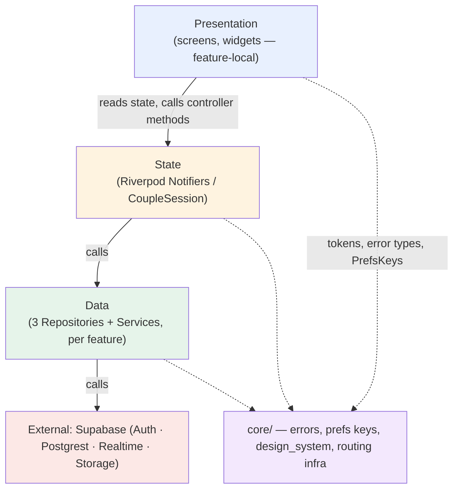
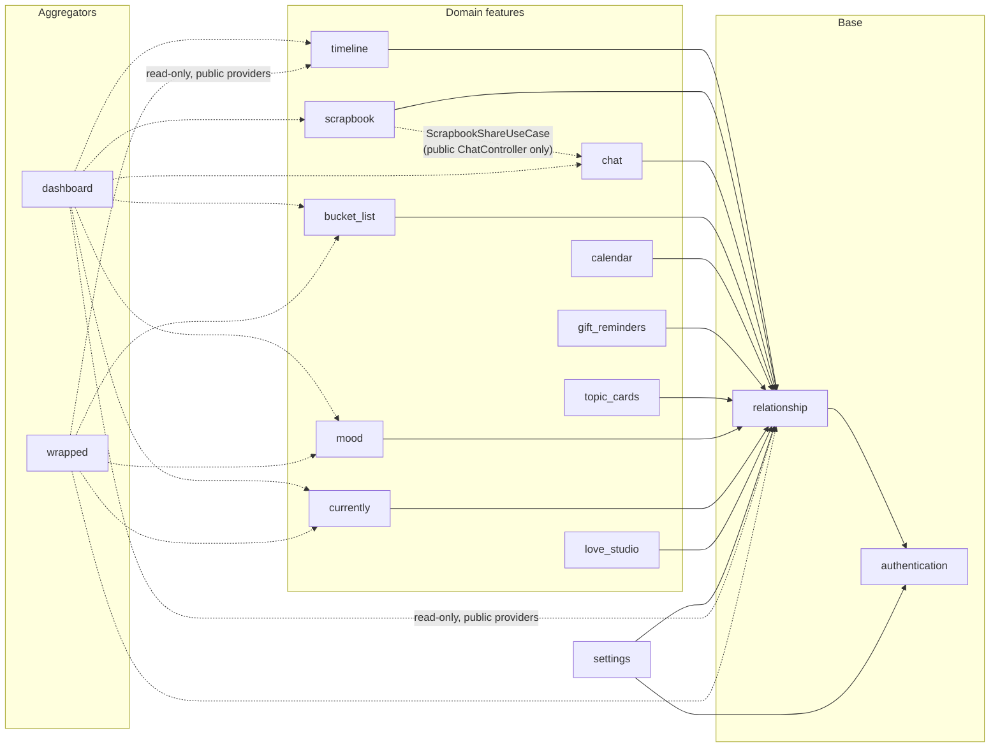
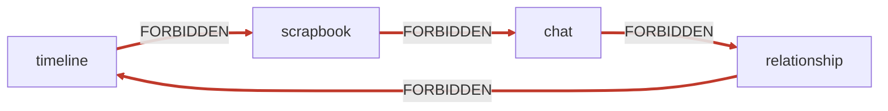
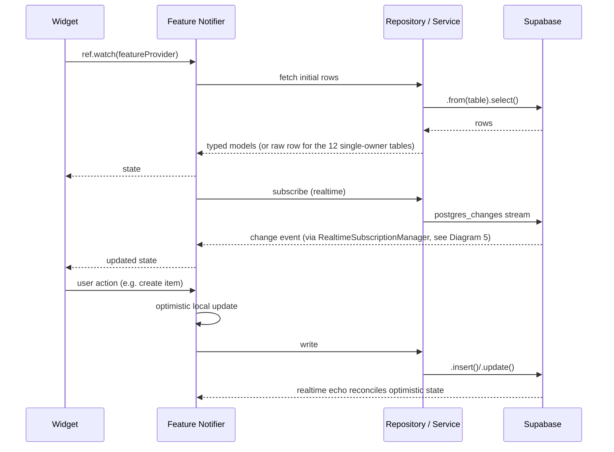
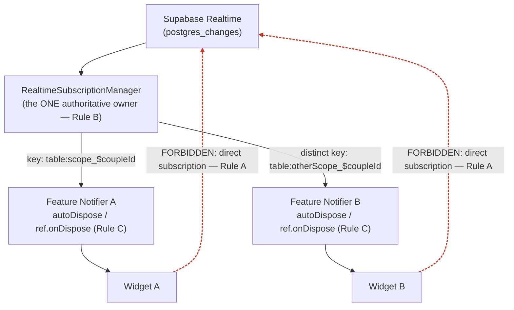
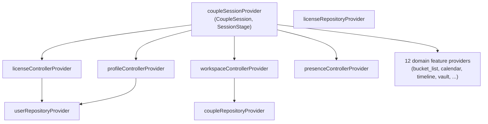
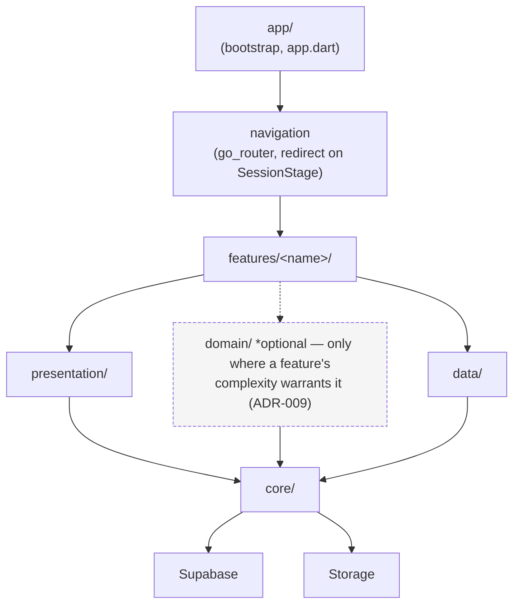

# Architecture Overview

**PROPOSED.** Visual reference for the architecture defined across this specification, the ADRs, and the satellite documents. Every diagram here is a picture of a decision recorded elsewhere — this document does not introduce new decisions, only shows them.

Days Together is a **feature-oriented modular architecture with lightweight domain/business logic where complexity warrants it** — see the main specification's "Architectural Philosophy" section for the full distinction from Domain-Driven Design, which this app deliberately does not adopt wholesale.

---

## 1. High-level layered architecture

**Rule this diagram encodes (architecture-rules.md Rules 1, 2, 12, 13, 15):** arrows only point downward or sideways into `core/`. Nothing in `core/` points back up into presentation, state, or data. `EXT` (Supabase) is reached only from `DATA` — never from `UI` or directly from a widget, per ADR-004.

---

## 2. Feature / module diagram

**Solid arrows** = a normal feature dependency (depends on `relationship`/`authentication` for couple scoping). **Dotted arrows** = read-only, public-provider-only dependency (the `dashboard`/`wrapped` aggregation pattern, and the one sanctioned `scrapbook → chat` write path via `ScrapbookShareUseCase`, per ADR-009/ADR-013). No arrow ever points *into* `authentication` or `relationship` from a domain feature — that direction is what the forbidden-cycle rule (below) exists to prevent.

---

## 3. The forbidden cycle, explicitly

This exact cycle — `timeline → scrapbook → chat → relationship → timeline` — is named explicitly in `feature-boundaries.md` and enforced by the architecture test's acyclic-graph check (`testing-strategy.md`). The one real edge in this diagram that *does* exist, `scrapbook → chat`, is sanctioned **only** in the one-directional, public-provider form shown in Diagram 2 — `chat` importing anything from `scrapbook`, or `relationship` depending on any downstream feature, remains forbidden regardless.

---

## 4. Data flow (a single feature, read + write)

---

## 5. Supabase / realtime architecture

This is the diagram behind the `love_notes` fix (ADR-013): Notifier A (`chat`) and Notifier B (`scrapbook`) both ultimately read the same table, but through **two distinct keys** at the manager, each server-side filtered — never one shared, client-filtered key.

---

## 6. State management topology (Riverpod, post-migration)

**Note:** `LicenseController` depends on `userRepositoryProvider`, not `licenseRepositoryProvider` — despite the naming similarity, the app's 28 license fields live on the `users` table in the current live code path. `LicenseRepository`/`license_details` backs a separate, narrower certificate-metadata concern. Full explanation in `state-management.md` and `migration-roadmap.md`'s Phase 0 section — this correction was discovered by reading the actual migration history during specification verification, not assumed.

Every arrow is a `ref.watch`/`ref.read` dependency — the structural equivalent of today's `ChangeNotifierProxyProvider<RelationshipProvider, X>` fan-out, now expressed with compile-time-checked references instead of a runtime type lookup against a single god provider. See `state-management.md` for the strangler-bridge mechanics that get the app from the current Provider tree to this topology without a big-bang cutover.

---

## 7. Dependency diagram (internal feature structure)

`domain/` is dashed and marked optional deliberately — per ADR-009, exactly one feature (`scrapbook`) has one. Every other feature is `presentation/ → data/` directly, with no empty `domain/` folder created "for consistency."

### Forbidden dependency directions (explicit)

- `core/` → `features/**` — **forbidden** (Rule 12). `core/` and `shared/` never import a feature.
- `data/` → `presentation/` — **forbidden**. A repository/service never imports a screen or widget.
- `presentation/` → `Supabase` directly, bypassing `data/` — **forbidden** (Rule 1/ADR-004).
- Any `features/<A>/` → non-public path in `features/<B>/` — **forbidden** (Rule 11). Only a feature's intentionally-exported providers/types are reachable from outside it.
- Any cycle in the feature dependency graph — **forbidden** (see Diagram 3).
- `services/**` → `screens/**`/`widgets/**` — **forbidden** (Rule 15/ADR-007). A service emits a navigation intent; it does not import a screen to push it directly.

---

## 8. Migration roadmap, at a glance

```mermaid
flowchart LR
    P0[Phase 0<br/>Foundations] --> P1[Phase 1<br/>CoupleSession]
    P1 --> P2[Phase 2<br/>Host Riverpod]
    P2 --> P3[Phase 3<br/>go_router]
    P3 --> P4[Phase 4<br/>3 Repositories +<br/>immutability]
    P4 --> P5[Phase 5<br/>Split god provider]
    P5 --> P5B[Phase 5b<br/>Convert 27 UI files]
    P5B --> P6[Phase 6<br/>Port 12 providers,<br/>retire Provider]
    P6 --> P7[Phase 7<br/>Design tokens<br/>+ shell]
    P7 --> P7B[Phase 7b<br/>Relocate widgets]
    P7B --> P8[Phase 8<br/>God-screen<br/>decomposition]
```

Full detail, including per-phase risk/validation/exit criteria and the Definition-of-Done traceability, lives in `migration-roadmap.md`.
