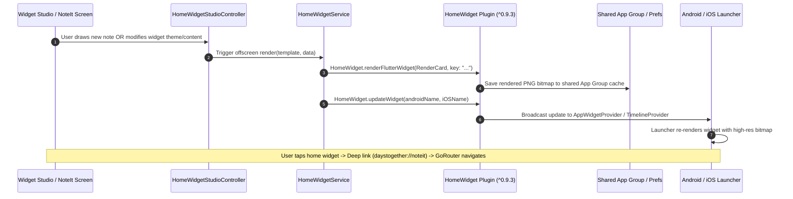

# Home Screen Widgets Redesign Design Specification

**Feature:** Home Screen Widgets Redesign & In-App Widget Studio  
**Date:** 2026-08-30  
**Status:** In Review (Superpowers Architectural Spec)  
**Package:** `home_widget: ^0.9.3`  
**Architecture:** Feature-Based Modular (ADR-001), Atomic Presentation (ADR-008), Lightweight Domain (ADR-009), Riverpod State (ADR-002)

---

## 1. Overview & Objectives

The goal of this feature is to completely elevate the home screen experience for the *Days Together* relationship app by introducing:
1. **"NoteIt" Live Partner Drawing Widget (2x2 Small):** Displays the partner's latest handwritten canvas drawing directly on the phone's home screen, with one-tap deep-linking (`daystogether://noteit`) to instantly open the drawing canvas and reply.
2. **Redesigned "Days Together" Relationship Counter (2x2 Small & 4x2 Medium):** Replaces the basic plain counter with a luxury glassmorphic card showcasing partner avatars, elapsed duration, live stopwatch formatting, and upcoming anniversary milestones (`daystogether://duration`).
3. **In-App "Home Widget Studio" Screen:** A dedicated customization hub featuring:
   - Interactive live phone mockup preview.
   - Real-time content editing (change custom titles, nicknames, milestone tags, and select pinned drawing history).
   - Theme palette selection (`Midnight Glass`, `Rose Quartz`, `Neon Violet`, `Azure Liquid`, `Lovely Off-White`, and `Custom Theme`).
   - One-tap system pinning (Android `HomeWidget.requestPinWidget()`).
   - Step-by-step setup guides for iOS WidgetKit and Android launcher widgets.

---

## 2. System Architecture & Feature Layout

Adhering to the project's **Feature-Based Modular Architecture (ADR-001)** and **Atomic Presentation Scope (ADR-008)**, all widget studio and rendering logic lives under `lib/features/home_widgets/`:

```
lib/
├── features/
│   └── home_widgets/
│       ├── domain/
│       │   ├── home_widget_models.dart           # HomeWidgetType, WidgetThemeConfig, WidgetContentData
│       │   └── home_widget_constants.dart        # Sizing constants, default keys, deep link URIs
│       ├── data/
│       │   └── home_widget_repository.dart       # SharedPreferences / App Group persistence for widget settings
│       └── presentation/
│           ├── controllers/
│           │   └── home_widget_studio_controller.dart # Riverpod Notifier for preview & live editing state
│           ├── screens/
│           │   └── home_widget_studio_screen.dart     # Main Studio screen
│           ├── components/
│           │   ├── atoms/
│           │   │   ├── widget_theme_chip.dart         # Theme color selector chip
│           │   │   ├── widget_pin_button.dart         # One-tap Add to Home Screen action button
│           │   │   └── widget_size_badge.dart         # 2x2 / 4x2 size indicator
│           │   ├── molecules/
│           │   │   ├── widget_device_frame.dart       # Realistic iOS / Android home screen preview frame
│           │   │   ├── widget_content_editor.dart     # Live form controls for title, format & milestone text
│           │   │   └── widget_theme_picker.dart       # Horizontal scrollable theme selector
│           │   └── organisms/
│           │       ├── widget_live_preview_card.dart  # Interactive preview renderer
│           │       └── render_templates/
│           │           ├── noteit_2x2_render_card.dart        # Offscreen render template for NoteIt 2x2
│           │           ├── days_together_2x2_render_card.dart # Offscreen render template for 2x2 Counter
│           │           └── days_together_4x2_render_card.dart # Offscreen render template for 4x2 Counter
├── services/
│   └── home_widget_service.dart                       # Platform channel manager (home_widget: ^0.9.3)
```

---

## 3. Data Flow & Rendering Pipeline



### 3.1 Offscreen Bitmap Rendering
* Uses `HomeWidget.renderFlutterWidget()` to render the exact Flutter widget tree offscreen into a high-density PNG file (`logicalSize: 320x320` for 2x2 and `640x320` for 4x2).
* **Fidelity Guarantee:** Captures custom vector strokes from `ScaleDrawingPainter`, Google Fonts typography, glassmorphism `BackdropFilter`/borders, and theme gradients with zero cross-platform visual discrepancy.

### 3.2 Deep-Link Routing (`GoRouter`)
* Deep Link URIs:
  * `daystogether://noteit`: Opens `/together/noteit` to start drawing a response.
  * `daystogether://duration`: Opens `/together` (Relationship Milestones & Live Duration tab).
* Handled in `main.dart` via `HomeWidget.initiallyLaunchedFromHomeWidget()` and runtime `HomeWidget.widgetClicked.listen()`.

---

## 4. Native Platform Integration

### 4.1 Android Native Layer
1. **`NoteitWidgetProvider.kt` (New):**
   - AppWidget provider registered in `AndroidManifest.xml`.
   - Layout: `res/layout/noteit_widget.xml` displaying the rendered drawing bitmap in an `ImageView` with a clickable `PendingIntent`.
   - Configuration: `res/xml/noteit_widget_info.xml` (`minWidth="140dp"`, `minHeight="140dp"`, `targetCellWidth="2"`, `targetCellHeight="2"`).
2. **`DaysTogetherWidgetProvider.kt` (Updated):**
   - Updated layout: `res/layout/days_together_widget.xml` supporting high-res rendered image cards with fallback text and deep link `daystogether://duration`.
3. **One-Tap Pinning:**
   - Supported via `HomeWidget.requestPinWidget(androidName: "NoteitWidgetProvider")`.

### 4.2 iOS Native Layer (WidgetKit & SwiftUI)
1. **`DaysTogetherWidgetBundle.swift`:**
   - Bundles both `NoteitWidget` and `DaysTogetherWidget`.
2. **`NoteitWidget.swift` (New):**
   - SwiftUI TimelineProvider reading `noteit_rendered_image.png` from App Group `group.com.szacheo.days_together`.
   - Supported family: `.systemSmall` (2x2).
   - `.widgetURL(URL(string: "daystogether://noteit"))`.
3. **`DaysTogetherWidget.swift` (Updated):**
   - Supported families: `.systemSmall` (2x2) and `.systemMedium` (4x2).
   - `.widgetURL(URL(string: "daystogether://duration"))`.

---

## 5. Domain Entities & State Management

### 5.1 Domain Models (`home_widget_models.dart`)
```dart
enum HomeWidgetType { noteit2x2, daysTogether2x2, daysTogether4x2 }

enum DaysCounterFormat { totalDays, yearsMonthsDays, compact }

class HomeWidgetConfig {
  final ThemeType themeType;
  final DaysCounterFormat counterFormat;
  final String customTitle;
  final String customMilestoneTag;
  final String? selectedDrawingId;
  final bool showSeconds;
  final bool showMilestone;

  const HomeWidgetConfig({
    this.themeType = ThemeType.midnightRose,
    this.counterFormat = DaysCounterFormat.totalDays,
    this.customTitle = 'Days Together',
    this.customMilestoneTag = '4th Anniversary',
    this.selectedDrawingId,
    this.showSeconds = true,
    this.showMilestone = true,
  });
}
```

### 5.2 Riverpod State Controller (`home_widget_studio_controller.dart`)
```dart
class HomeWidgetStudioState {
  final HomeWidgetType selectedWidgetType;
  final HomeWidgetConfig config;
  final bool isRendering;
  final String? statusMessage;

  const HomeWidgetStudioState({...});
}

class HomeWidgetStudioNotifier extends Notifier<HomeWidgetStudioState> {
  // Methods for updating live title, format, theme, selecting drawing, and syncing to OS
}
```

---

## 6. Atomic Component Breakdown (ADR-008)

* **Atoms:**
  * `WidgetThemeChip`: Displays a miniature circular theme color gradient with active selection ring.
  * `WidgetPinButton`: Primary glass action button with launcher pin icon.
  * `WidgetSizeBadge`: Pill badge indicating `2x2 Small` or `4x2 Medium`.
* **Molecules:**
  * `WidgetDeviceFrame`: Mockup wrapper giving the user a realistic preview of how the widget looks placed on an iOS / Android launcher wallpaper.
  * `WidgetContentEditor`: Dynamic form controls allowing live text input for custom titles, anniversary milestone tags, and counter format toggles.
  * `WidgetThemePicker`: Horizontal selector for instant theme switching.
* **Organisms:**
  * `WidgetLivePreviewCard`: Interactive preview component that dynamically reflects all active edits.
  * `Noteit2x2RenderCard`: Isolated Flutter renderable widget tree for the 2x2 NoteIt card.
  * `DaysTogether2x2RenderCard`: Isolated Flutter renderable widget tree for the 2x2 Days Together card.
  * `DaysTogether4x2RenderCard`: Isolated Flutter renderable widget tree for the 4x2 Days Together card.

---

## 7. Automated Verification & Testing Strategy (ADR-012)

1. **Unit Tests (`test/features/home_widgets/`):**
   - `home_widget_models_test.dart`: Serialization, copyWith, and defaults validation.
   - `home_widget_studio_controller_test.dart`: State transitions, theme switching, and content editing.
   - `home_widget_service_test.dart`: Duration formatting closed-form tests, render payload preparation, and deep link URI verification.
2. **Widget Tests (`test/features/home_widgets/presentation/`):**
   - `home_widget_studio_screen_test.dart`: Verifies live preview responsiveness, theme switching, and atomic component rendering.
3. **Architecture Boundary Tests:**
   - Verifies `lib/features/home_widgets/` contains no direct Supabase imports (Rule 1) and no circular dependencies (Rule 11).
